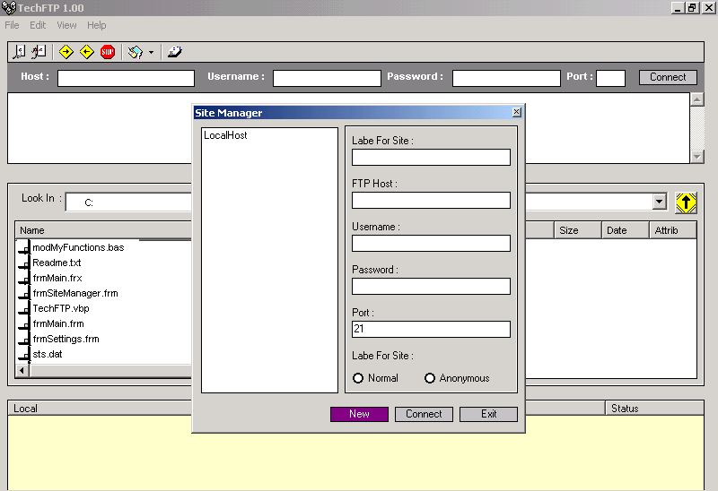



## \_TechFTP \- A Complete FTP Client with Cool Interface\.

### Description

Complete FTP Client. Download, Upload, Queues, Site Manager etc. Features like CuteFTP. Used almost all common control (useful for new coders) Illustrates use of winsock control to create FTP Client.
 
### More Info
 

             |
---                |---
**Submitted On**   |2002-05-08 14:21:32
**By**             |[Muktak Joshi](https://github.com/Planet-Source-Code/PSCIndex/blob/master/ByAuthor/muktak-joshi.md)
**Level**          |Intermediate
**User Rating**    |4.8 (360 globes from 75 users)
**Compatibility**  |VB 5\.0, VB 6\.0
**Category**       |[Internet/ HTML](https://github.com/Planet-Source-Code/PSCIndex/blob/master/ByCategory/internet-html__1-34.md)
**World**          |[Visual Basic](https://github.com/Planet-Source-Code/PSCIndex/blob/master/ByWorld/visual-basic.md)
**Archive File**   |[\_A\_Complet80668582002\.zip](https://github.com/Planet-Source-Code/muktak-joshi-techftp-a-complete-ftp-client-with-cool-interface__1-34413/archive/master.zip)

